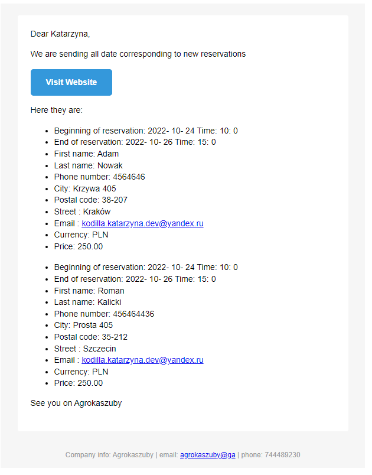

# Agrokaszuby-Backend

### **Features**:
* **F1** - Flat reservation
* **F2** - Related tables
* **F3** - [Frontend] Weather API - Forecast for seven days
* **F4** - [Frontend] Currency exchange API - Add Price with PLN and USD
* **F5** - Reservation form validation
* **F6** - Design patterns
* **F7** - [Backend] Scheduler - sending email with all reservations each day
* **F8** - Application instruction
* **F9** - Currency exchange REST API
* **F10** - Question feature
* **F11** - Comment feature
* **F12** - Comment Log feature

#### GitHub repos

------
* **Backend**: https://github.com/KatarzynaNabozny/Agrokaszuby-Backend 
------
Port: http://localhost:8090 

## 1. REST ENDPOINTS (F1, F2, F10, F11)

### Reservation
1. Get all reservations: GET http://localhost:8090/agrokaszuby/backend/reservation
2. Get reservation by id: GET http://localhost:8090/agrokaszuby/backend/reservation/{id}
3. Get reservation by email: GET http://localhost:8090/agrokaszuby/backend/reservation/byemail/{email}
4. Create reservation: POST http://localhost:8090/agrokaszuby/backend/reservation \
  &nbsp;&nbsp;Example Body:
```
    {
        "reservationId": null,
        "startDate": [2022,10,22,10,0],
        "endDate": [2022,10,26,13,0],
        "firstName": "Katarzyna",
        "lastName": "Nowak",
        "phoneNumber": "4564646",
        "city": "Kraków 90",
        "postalCode": "31-207",
        "street": "Toki",
        "email": "kodilla.katarzyna.dev@yandex.ru",
        "currency": "PLN",
        "price": "200.00"
    }
```
5. Update reservation: PUT http://localhost:8090/agrokaszuby/backend/reservation
6. Delete reservation by id: DELETE http://localhost:8090/agrokaszuby/backend/reservation/{id} 
7. Delete reservation by email, startDate and endDate:
DELETE http://localhost:8090/agrokaszuby/backend/reservation?email={email}&startDate={startDate}&endDate={endDate} 
example:
```
DELETE http://localhost:8090/agrokaszuby/backend/reservation?email=kodilla.katarzyna.dev@gmail.com&startDate=2022-10-19T10:00:00&endDate=2022-10-26T13:00:00 
```
### CurrencyExchange
8. Get all currency exchange: GET http://localhost:8090/agrokaszuby/backend/currency_exchange
9. Get currency exchange by id: GET http://localhost:8090/agrokaszuby/backend/currency_exchange/{id}
10. Create currency exchange: POST http://localhost:8090/agrokaszuby/backend/currency_exchange \
   &nbsp;&nbsp;Example Body:
```
    {
        "currencyExchangeId": null,
        "fromCurrency": "PLN",
        "toCurrency": "USD",
        "date": [2022,10,26],
        "rate": "0.22"
    }
```
11. Update currency exchange: PUT http://localhost:8090/agrokaszuby/backend/currency_exchange
12. Delete currency exchange by id: DELETE http://localhost:8090/agrokaszuby/backend/currency_exchange/{id}
13. Get currency exchange by fromCurrency: GET http://localhost:8090/agrokaszuby/backend/currency_exchange/search/from_currency?fromCurrency=PLN
14. Get currency exchange by toCurrency: GET http://localhost:8090/agrokaszuby/backend/currency_exchange/search/to_currency?toCurrency=USD
15. Get currency exchange by date: GET http://localhost:8090/agrokaszuby/backend/currency_exchange/search/date?date=2022-10-26
16. Get currency exchange by fromCurrency, toCurrency and date: \
GET http://localhost:8090/agrokaszuby/backend/currency_exchange/search/from_to_currency_date?fromCurrency=PLN&toCurrency=USD&date=2022-10-26

### Comment (F11)

17. Get all comments: GET http://localhost:8090/agrokaszuby/backend/comment
18. Get comment by id: GET http://localhost:8090/agrokaszuby/backend/comment/search/id/{id}
19. Get comment by email: GET http://localhost:8090/agrokaszuby/backend/comment/search/email/{emial}
20. Create comment: POST http://localhost:8090/agrokaszuby/backend/comment \
    &nbsp;&nbsp;Example Body:
```
    {
        "commentId": null,
        "fromName": "Kasia",
        "email": "knnabozny@gmail.com",
        "content": "I really liked to stay in Agrokaszuby",
        "subject": "Soon",
        "date": [2022,6,14,10,0]
    }
```
21. Update comment: PUT http://localhost:8090/agrokaszuby/backend/comment 
22. Delete comment by id: DELETE http://localhost:8090/agrokaszuby/backend/comment/{id}
23. Delete comment by id: DELETE http://localhost:8090/agrokaszuby/backend/comment/delete/subject_email?subject={subject}&email={email}
24. Delete comment by subject: DELETE http://localhost:8090/agrokaszuby/backend/comment/delete/subject?subject={subject}
25. Delete comment by email: DELETE http://localhost:8090/agrokaszuby/backend/comment/delete/email?email={emial}

### Question (F10)

26. Get all questions: GET http://localhost:8090/agrokaszuby/backend/question
27. Get question by id: GET http://localhost:8090/agrokaszuby/backend/question/search/id/{id}
28. Get question by email: GET http://localhost:8090/agrokaszuby/backend/question/search/email/{emial}
29. Create question: POST http://localhost:8090/agrokaszuby/backend/question \
    &nbsp;&nbsp;Example Body:
```
    {
        "questionId": null,
        "fromName": "Kasia",
        "email": "knnabozny@gmail.com",
        "content": "I really liked to stay in Agrokaszuby",
        "subject": "Soon",
        "date": [2022,6,14,10,0]
    }
```
30. Update question: PUT http://localhost:8090/agrokaszuby/backend/question
31. Delete question by id: DELETE http://localhost:8090/agrokaszuby/backend/question/{id}
32. Delete question by id: DELETE http://localhost:8090/agrokaszuby/backend/question/delete/subject_email?subject={subject}&email={email}
33. Delete question by subject: DELETE http://localhost:8090/agrokaszuby/backend/question/delete/subject?subject={subject}
34. Delete question by email: DELETE http://localhost:8090/agrokaszuby/backend/question/delete/email?email={emial}

### Comment Log (F12)

35. GET http://localhost:8090/agrokaszuby/backend/comment_log
36. GET http://localhost:8090/agrokaszuby/backend/comment_log/{id}
37. DELETE http://localhost:8090/agrokaszuby/backend/comment_log/{id}
38. POST http://localhost:8090/agrokaszuby/backend/comment_log \
    &nbsp;&nbsp;Example Body:
```
  {
	"commentLogId": null,
	"email": "knnabozny@gmail.com",
    "event": "SAVE",
    "successful": "true",
    "date": [2022,6,14,10,0]
  }
```


## 3. SCHEDULER (Sending all reservations report F7)
Here is how this report looks like on the mailbox:




##### To run Backend needed DB MySql schema with name : '**agrokaszuby**'. Then you can run **BackendApplication.java**

------
* Frontend: https://github.com/KatarzynaNabozny/Agrokaszuby-Frontend 
------


